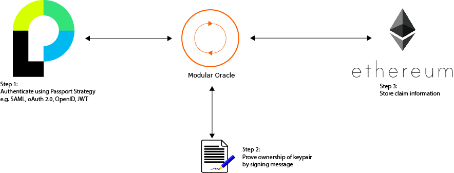

Pluggable Authentication Provider
=================================

Pluggable Authentication Provider as described in my master thesis [Towards self-sovereign identity using blockchain technology.](http://essay.utwente.nl/71274/)

It makes use of [Passport](http://passportjs.org/) to implement +300 authentication strategies with few lines of code.



Examples
--------

#### SAML

````javascript
passport.use(new SamlStrategy(
  {
    callbackUrl: 'https://127.0.0.1:3000/login/saml/return',
    path: '/login/saml/return',
    entryPoint: 'https://idp.diy.surfconext.nl/simplesaml/saml2/idp/SSOService.php',
    issuer: 'passport-saml'
  },
  function(profile, done) {
    findByEmail(profile.email, function(err, user) {
      if (err) {
        return done(err);
      }
      return done(null, user);
    });
  })
);
````

#### GitHub
````javascript
var GITHUB_CLIENT_ID = config.github_client_id;
var GITHUB_CLIENT_SECRET = config.github_client_secret;


passport.use(new GitHubStrategy({
    clientID: GITHUB_CLIENT_ID,
    clientSecret: GITHUB_CLIENT_SECRET,
    callbackURL: "https://127.0.0.1:3000/login/github/return"
  },
  function(accessToken, refreshToken, profile, done) {
    // asynchronous verification, for effect...
    process.nextTick(function () {

      // To keep the example simple, the user's GitHub profile is returned to
      // represent the logged-in user.  In a typical application, you would want
      // to associate the GitHub account with a user record in your database,
      // and return that user instead.
      return done(null, profile);
    });
  }
));
````
